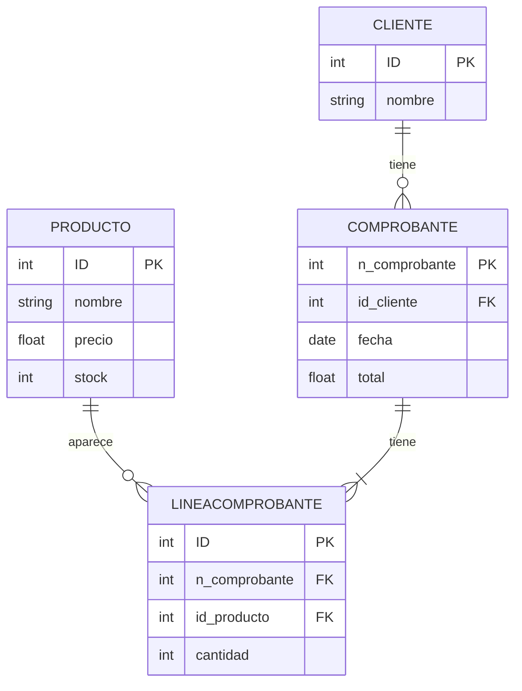
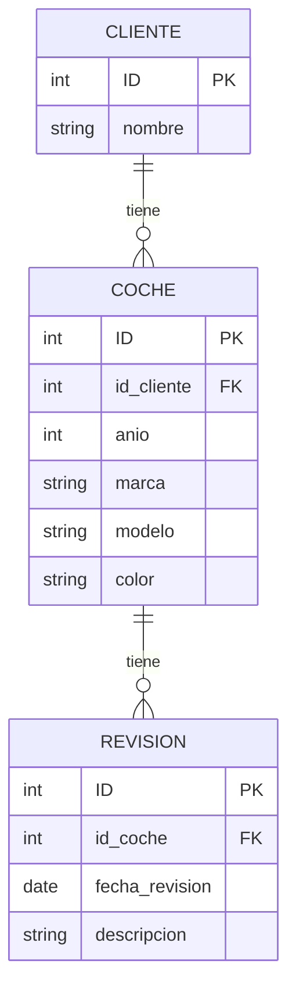

**Ejercicio**: Una mueblería necesita la implementación de una base de datos para controlar las ventas que realiza por día, el stock de sus artículos (productos) y la lista de sus clientes que realizan las compras.

+ ¿Cuáles serían las entidades de este sistema?: Producto, cliente, comprobante y linea de comprobante
+ ¿Qué atributos se determinarán para cada entidad? (Considerar los que se crean necesarios): 
  + Productos: ID, nombre, precio, stock
  + Cliente: ID, nombre
  + Comprobante: n_comprobante, id_cliente, fecha, total
  + Linea comprobante: id, n_comprobante, id_producto, cantidad
+ ¿Cómo se conformarán las relaciones entre entidades? ¿Cuáles serían las cardinalidades?: Un producto puede aparecer en muchas lineas de comprobantes pero una linea de comprobante solo puede tener un producto; Un comprobante puede tener muchas lineas de comprobante pero una linea de comprobante solo puede tener un comprobante; Un cliente puede tener muchos comprobantes pero un comprobante solo le pertenece a un cliente.

**Ejercicio**: Realizar un diagrama de entidad - relación para el sistema de una concesionaria, que desea gestionar los servicios de los coches de sus clientes. 

Para el módulo del sistema, se necesita almacenar información de los clientes, los coches que estos poseen y los service/revisiones de cada uno de esto

