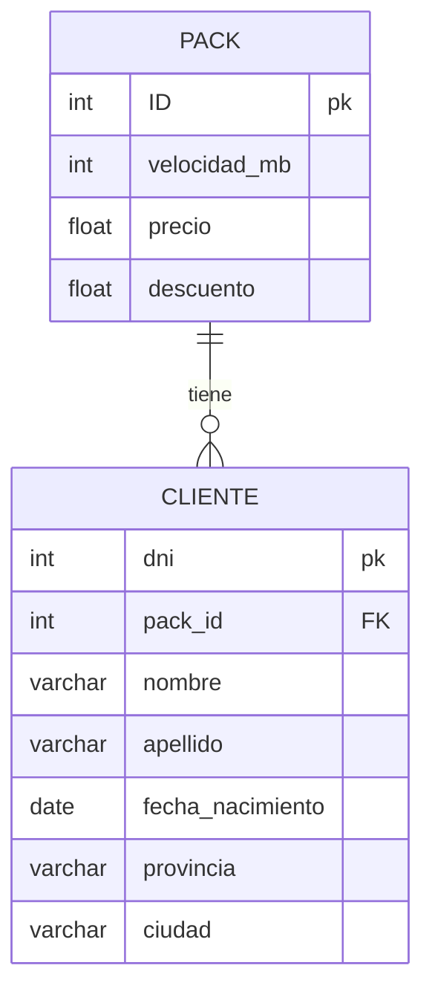

## Enunciado

Una empresa proveedora de Internet necesita una base de datos para almacenar cada uno de sus clientes junto con el plan/pack que tiene contratado.
Mediante un análisis previo se conoce que se tiene que almacenar la siguiente información:

+ De los clientes se debe registrar: dni, nombre, apellido, fecha de nacimiento, provincia, ciudad.
+ En cuanto a los planes de internet: identificación del plan, velocidad ofrecida en megas, precio, descuento.


## Ejercicio 1
Luego del planteo de los requerimientos de la empresa, se solicita modelar los mismos mediante un DER (Diagrama Entidad-Relación).




## Ejercicio 2
Una vez modelada y planteada la base de datos, responder a las siguientes preguntas:
1. ¿Cuál es la primary key para la tabla de clientes? Justificar respuesta
    > El id de la tabla clientes es su DNI ya que se supone que este es unico

2. ¿Cuál es la primary key para la tabla de planes de internet? Justificar respuesta.
    > En este caso definimos uan id autoincremental generica ya que en los campos no tenemos algo que identifique univocamente al pack

3. ¿Cómo serían las relaciones entre tablas? ¿En qué tabla debería haber foreign key? ¿A qué campo de qué tabla hace referencia dicha foreign key? Justificar respuesta.
    > La relacion seria one to many, i.e., cada cliente tiene uno y solo un pack y cada pack puede ser contratado por varios clientes. En este caso la FK puede agregarse en cualquiera de las dos tablas y la desicion depende del dominio del problema. Para este ejercicio decidi colocar la FK en la tabla CLIENTE y esta hace referencia a la tabla PACK.

## Ejercicio 3
Una vez realizado el planteo del diagrama y de haber respondido estas preguntas, utilizar PHPMyAdmin o MySQL Workbench para ejecutar lo siguiente:

1. Se solicita crear una nueva base de datos llamada “empresa_internet”.
    ```SQL
    /* Creacion de la base de datos */
    CREATE DATABASE IF NOT EXISTS empresa_internet;

    USE empresa_internet;   -- Seleccionamos la base de datos nueva

    /* Definicion del esquema de la base de datos */
    CREATE TABLE Clientes(
        ID int NOT NULL AUTO_INCREMENT,
        pack_id int NOT NULL,
        nombre varchar(30),
        apellido varchar(30),
        fecha_nacimiento date,
        provincia varchar(30),
        ciudad varchar(30),
        PRIMARY KEY (ID),
        FOREIGN KEY (pack_id) REFERENCES Packs(ID)
    );

    CREATE TABLE Packs(
        ID int NOT NULL AUTO_INCREMENT,
        velocidad_mb int NOT NULL,  
        precio double DEFAULT 0,
        descuento double DEFAULT 0,
        PRIMARY KEY (ID),
        CHECK (precio >= 0),
        CHECK (descuento >= 0 AND descuento <= 100)
    );
    ```
2. Incorporar 10 registros en la tabla de clientes y 5 en la tabla de planes de internet.
    ```SQL
    /* Insert de 5 packs */
    INSERT INTO Packs (velocidad_mb, precio, descuento)
    VALUES (1, 10, 0);

    INSERT INTO Packs (velocidad_mb, precio, descuento)
    VALUES (5, 100, 0);

    INSERT INTO Packs (velocidad_mb, precio, descuento)
    VALUES (10, 200, 0);

    INSERT INTO Packs (velocidad_mb, precio, descuento)
    VALUES (50, 1000, 25);

    INSERT INTO Packs (velocidad_mb, precio, descuento)
    VALUES (100, 10000, 20);


    /* Insert de 10 clientes */
    INSERT INTO Clientes (pack_id, nombre, apellido, fecha_nacimiento, provincia, ciudad)
    VALUES (1, 'Juan', 'Perez', '1990-01-01', 'Buenos Aires', 'CABA');

    INSERT INTO Clientes (pack_id, nombre, apellido, fecha_nacimiento, provincia, ciudad)
    VALUES (2, 'Maria', 'Garcia', '1992-01-01', 'Buenos Aires', 'CABA');
    
    INSERT INTO Clientes (pack_id, nombre, apellido, fecha_nacimiento, provincia, ciudad)
    VALUES (3, 'Pedro', 'Gomez', '1990-01-01', 'Buenos Aires', 'CABA');

    INSERT INTO Clientes (pack_id, nombre, apellido, fecha_nacimiento, provincia, ciudad)
    VALUES (4, 'Jose', 'Gomez', '1990-01-01', 'Buenos Aires', 'CABA');

    INSERT INTO Clientes (pack_id, nombre, apellido, fecha_nacimiento, provincia, ciudad)
    VALUES (5, 'Lucas', 'Gomez', '1990-01-01', 'Buenos Aires', 'CABA');

    INSERT INTO Clientes (pack_id, nombre, apellido, fecha_nacimiento, provincia, ciudad)
    VALUES (1, 'Mariano', 'Gomez', '1990-01-01', 'Buenos Aires', 'CABA');

    INSERT INTO Clientes (pack_id, nombre, apellido, fecha_nacimiento, provincia, ciudad)
    VALUES (2, 'Santiago', 'Gomez', '1990-01-01', 'Buenos Aires', 'CABA');

    INSERT INTO Clientes (pack_id, nombre, apellido, fecha_nacimiento, provincia, ciudad)
    VALUES (3, 'Matias', 'Gomez', '1990-01-01', 'Buenos Aires', 'CABA');

    INSERT INTO Clientes (pack_id, nombre, apellido, fecha_nacimiento, provincia, ciudad)
    VALUES (4, 'Martin', 'Gomez', '1990-01-01', 'Buenos Aires', 'CABA');

    INSERT INTO Clientes (pack_id, nombre, apellido, fecha_nacimiento, provincia, ciudad)
    VALUES (5, 'Agustin', 'Gomez', '1990-01-01', 'Buenos Aires', 'CABA');
    ```

3. Realizar las asociaciones/relaciones correspondientes entre estos registros.
    > Listo en el punto 1


## Ejercicio 4
Plantear 10 consultas SQL que se podrían realizar a la base de datos. Expresar las sentencias.

> Tomar como referencia el ejercicio 1 de la clase 1