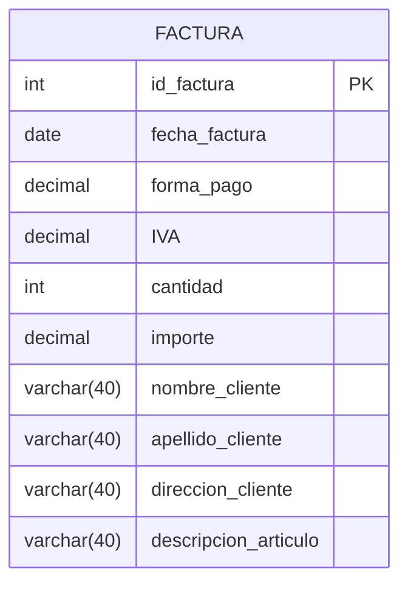
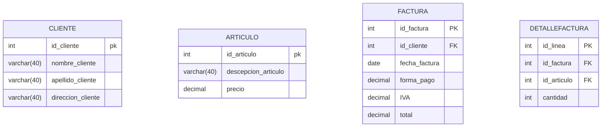

# Normalizacion

Normalizar la siguiente tabla:



En la tabla tenemos tres entidades, las cuales podemos separar: cliente, factura, articulo. Como en la factura necesitamos ademas describirla y hacerlo en la misma tabla es demasiado redundante, separamos el detalle de la factura en una nueva tabla.



# Creacion de tablas temporales e indices

## Ejercicio 1

1. Con la base de datos “movies”, se propone crear una tabla temporal llamada “TWD” y guardar en la misma los episodios de todas las temporadas de “The Walking Dead”.
```sql
CREATE TEMPORARY TABLE TWD
    SELECT e.title, e.`number`, s.title as season
      FROM episodes e
INNER JOIN seasons s ON s.id = e.season_id 
INNER JOIN series s2 ON s2.id = s.serie_id
     WHERE s2.title = "The Walking Dead"
```
2. Realizar una consulta a la tabla temporal para ver los episodios de la primera temporada.
```sql
SELECT * 
  FROM TWD
 WHERE season = "Primer Temporada" 
```

## Ejercicio 2

1. En la base de datos “movies”, seleccionar una tabla donde crear un índice y luego chequear la creación del mismo.
```sql
   /* Creacion del indice */
   CREATE INDEX rating_idx
   ON movies (rating)

   /* Verificacion de los indices existentes */
   SHOW INDEX FROM movies
```
2. Analizar por qué crearía un índice en la tabla indicada y con qué criterio se elige/n el/los campos.
> Al crear un indice estamos creando un nuevo hashmap que la tabla puede consultar a la hora de realizar una nueva consulta. Claramente la existencia de un nuevo hashmap sobre campos estrategicos agiliza las querys que imponen condiciones sobre tales campos.
>
> El problema esta en que cuando la tabla cambia se deben actualizar los indices. Por lo que los indices deben hacerse unicamente en tablas relativamente estables. Por otro lado el objetivo fundamental de un indice es agilizar consultas frecuentes y costosas, por lo que solo tiene sentido definir indices para las consultas mas comunes.

## Ejercicio 3

1. Agregar una película a la tabla movies.
```sql
INSERT INTO movies_db.movies
    (created_at, updated_at, title, rating, awards, release_date, `length`, genre_id)
VALUES
    (NULL, NULL, 'Toy Story 3', 7.9, 3, '2016-01-04 00:00:00', 120, 7);
```
2. Agregar un género a la tabla genres.
```sql
INSERT INTO movies_db.genres
    (created_at, updated_at, name, ranking, active)
VALUES
    (NOW(), NULL, 'Fantasia oscura', 13, 1);
```
3. Asociar a la película del punto 1. genre el género creado en el punto 2.
```sql
UPDATE movies m
   SET m.genre_id = (SELECT id FROM genres WHERE name="Fantasia Oscura")
 WHERE m.title = "Toy Story 3"
```
4. Modificar la tabla actors para que al menos un actor tenga como favorita la película agregada en el punto 1.
```sql
UPDATE actors s
   SET s.favorite_movie_id = (SELECT id FROM movies m WHERE m.title = "Toy Story 3")
 WHERE s.id = 1
```
5. Crear una tabla temporal copia de la tabla movies.
```sql
CREATE TEMPORARY TABLE MOVIESCPY 
SELECT * FROM movies
```
6. Eliminar de esa tabla temporal todas las películas que hayan ganado menos de 5 awards.
```sql
DELETE FROM MOVIESCPY m
WHERE m.awards < 5
```
7. Obtener la lista de todos los géneros que tengan al menos una película.
```sql
    SELECT g.*, count(*) AS movie_count
      FROM genres g 
INNER JOIN movies m ON m.genre_id = g.id 
  GROUP BY g.id 
    HAVING movie_count > 0 
```
8. Obtener la lista de actores cuya película favorita haya ganado más de 3 awards.
```sql
    SELECT a.first_name, a.last_name, m.title, m.awards  
      FROM actors a 
INNER JOIN movies m ON m.id = a.id
     WHERE m.awards > 3
```
9. Crear un índice sobre el nombre en la tabla movies.
```sql
CREATE INDEX title_idx
ON movies (title)
```
10. Chequee que el índice fue creado correctamente.
```sql
SHOW INDEX FROM movies
```
11. En la base de datos movies ¿Existiría una mejora notable al crear índices? Analizar y justificar la respuesta.
> Si existen ventajas importantes al agregar un indice a la tabla movies porque es muy comun realizar consultas condicionando el nombre de la pelicula. La tabla movies parece ser bastante estable y de proporciones acotadas por lo que agregar un indice agrega buenos beneficios considerando sus costos. 

12. ¿En qué otra tabla crearía un índice y por qué? Justificar la respuesta
> En series se pude crear un indice basicamente con las mismas motivaciones que en movies.  